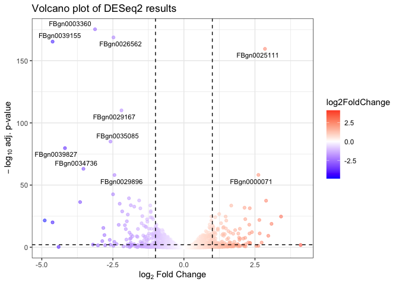

Differential Abundance plots
================
Roberto Olayo
2025-06-30

In this template, we look at how to create differential abundance plots
using the `ggplot2` package in R. This is useful for visualizing
differences in abundance of features between different groups or
conditions in your data. A typical output could be the results
data.frame from `DESeq2` or `edgeR` analyses, which contains log fold
changes and p-values for each feature.

## An example on the Pasilla dataset.

Here, we will work on creating differential abundance plots for the
pasilla dataset.

``` r
library(DESeq2)
library(pasilla)
library(tidyverse)
```

``` r
# Count data
fn = system.file("extdata", "pasilla_gene_counts.tsv",
                 package = "pasilla", mustWork = TRUE)

counts = as.matrix(read.csv(fn, sep = "\t", row.names = "gene_id"))

counts_filt <- counts[rowSums(counts) > 10, ]


# Annotation data
annotationFile = system.file("extdata",
                             "pasilla_sample_annotation.csv",
                             package = "pasilla", mustWork = TRUE)

pasillaSampleAnno = read_csv(annotationFile, show_col_types = FALSE) %>%
  mutate( condition = factor(condition, levels = c("untreated", "treated")),
          type = factor(sub("-.*", "", type), levels = c("single", "paired")))

mt = match(colnames(counts), sub("fb$", "", pasillaSampleAnno$file))

pasillaSampleAnno <- pasillaSampleAnno[mt,]
```

The matrix tallies the number of reads seen for each gene in each
sample. It contains 7 samples and 14599 genes.

We can now perform differential expression analysis using the `DESeq2`
package.

``` r
dds <- DESeqDataSetFromMatrix(countData = counts_filt,
                              colData = pasillaSampleAnno,
                              design = ~ type + condition)

## Differential expression analysis
dds <- DESeq(dds)
```

    ## estimating size factors

    ## estimating dispersions

    ## gene-wise dispersion estimates

    ## mean-dispersion relationship

    ## final dispersion estimates

    ## fitting model and testing

## Volcano plots.

Now that we have the results from differential expression analysis, we
can create a volcano plot to visualize the results. A volcano plot
displays the log fold change on the x-axis and the negative log10
p-value on the y-axis. In this way, we can easily see which features (in
this case, genes) are significantly differentially expressed. Whenever
you have a p-value and a log fold change, you can create a volcano plot.

``` r
# Get results from DESeq2
dds_results <- results(dds, contrast = c("condition", "treated", "untreated")) %>% 
  as.data.frame() %>% 
  rownames_to_column("gene")

dds_results %>% head() %>% knitr::kable()
```

| gene | baseMean | log2FoldChange | lfcSE | stat | pvalue | padj |
|:---|---:|---:|---:|---:|---:|---:|
| FBgn0000008 | 95.139884 | -0.0407290 | 0.2198747 | -0.1852373 | 0.8530429 | 0.9506023 |
| FBgn0000017 | 4352.330929 | -0.2562416 | 0.1122594 | -2.2825852 | 0.0224548 | 0.1313064 |
| FBgn0000018 | 418.586059 | -0.0647999 | 0.1313221 | -0.4934423 | 0.6217001 | 0.8609968 |
| FBgn0000024 | 6.405811 | 0.3086048 | 0.7551078 | 0.4086897 | 0.6827674 | 0.8893549 |
| FBgn0000032 | 989.661627 | -0.0485676 | 0.1208607 | -0.4018476 | 0.6877962 | 0.8913453 |
| FBgn0000037 | 14.093657 | 0.4531415 | 0.5261097 | 0.8613061 | 0.3890695 | 0.7147082 |

A basic volcano plot can be created using `ggplot2` as follows:

``` r
ggplot(dds_results, 
       aes(x = log2FoldChange, y = -log10(padj))) + # We plot the relationship between log2FC and -log10(pvalue)
  
  
  
  geom_point(aes(color = log2FoldChange), alpha = 0.5) + # We can color the points by the intensity of the log2 fold change
  
  
  
  scale_color_gradient2(low = "blue",
                        mid="white",
                        high="red") + # We use a diverging color palette to represent the log2 fold change. Typically, values > 0 are red and values < 0 are blue.
  
  
  geom_hline(yintercept = -log10(0.01), linetype = "dashed", color = "black") + # We add a horizontal line at -log10(0.05) to indicate the significance threshold
  geom_vline(xintercept = c(-1, 1), linetype = "dashed", color = "black") + # We add vertical lines at -1 and 1 to indicate the fold change thresholds
  
  
  labs(title = "Volcano plot of DESeq2 results",
       x = latex2exp::TeX("$log_{2}$ Fold Change"),
       y = latex2exp::TeX("$-log_{10}$ adj. p-value")) +
  theme_bw()
```

<!-- -->

This is a standrd Volcano plot that aids visualization of the
differential abundance resutls. One can customize the plot further by
adding labels, changing colors, or adjusting the theme. One typical
addition is to add the significant features to the plot, which can be
done using the `geom_text_repel` function from the `ggrepel` package. In
this case, we can look at the top 10 most significant features and label
them in the plot.

``` r
library(ggrepel)

top_n <- dds_results %>%
  arrange(padj) %>%
  slice_head(n = 10)

vp.with.annots <- ggplot(dds_results, 
       aes(x = log2FoldChange, y = -log10(padj))) +
  geom_point(aes(color = log2FoldChange), alpha = 0.5) +
  scale_color_gradient2(low = "blue",
                        mid="white",
                        high="red") +
  geom_hline(yintercept = -log10(0.01), linetype = "dashed", color = "black") +
  geom_vline(xintercept = c(-1, 1), linetype = "dashed", color = "black") +
  labs(title = "Volcano plot of DESeq2 results",
       x = latex2exp::TeX("$log_{2}$ Fold Change"),
       y = latex2exp::TeX("$-log_{10}$ adj. p-value")) +
  theme_bw() +
  geom_text_repel(data = top_n, aes(label = gene), 
                  size = 3, max.overlaps = Inf)


vp.with.annots
```

<!-- -->

This plot now includes labels for the top 10 most significant features,
making it easier to identify them in the context of the overall results.
This pretty much ready for custom modifications and can be used as a
template for creating differential abundance plots in your own analyses.

To save this plot as an image file, you can use the `ggsave` function:

``` r
# Save the plot as a PNG and PDF file
# Publication quality images typically have a resolution of 300 dpi

ggsave("figures/volcano_plot_r.png", plot = vp.with.annots, dpi = 300)
```

    ## Saving 7 x 5 in image

    ## Warning: Removed 1143 rows containing missing values or values outside the scale range
    ## (`geom_point()`).

``` r
ggsave("figures/volcano_plot_r.pdf", plot = vp.with.annots, dpi = 300)
```

    ## Saving 7 x 5 in image

    ## Warning: Removed 1143 rows containing missing values or values outside the scale range
    ## (`geom_point()`).

## Session Information.

``` r
sessionInfo()
```

    ## R version 4.3.1 (2023-06-16)
    ## Platform: x86_64-apple-darwin20 (64-bit)
    ## Running under: macOS 15.5
    ## 
    ## Matrix products: default
    ## BLAS:   /Library/Frameworks/R.framework/Versions/4.3-x86_64/Resources/lib/libRblas.0.dylib 
    ## LAPACK: /Library/Frameworks/R.framework/Versions/4.3-x86_64/Resources/lib/libRlapack.dylib;  LAPACK version 3.11.0
    ## 
    ## locale:
    ## [1] en_US.UTF-8/en_US.UTF-8/en_US.UTF-8/C/en_US.UTF-8/en_US.UTF-8
    ## 
    ## time zone: Europe/Berlin
    ## tzcode source: internal
    ## 
    ## attached base packages:
    ## [1] stats4    stats     graphics  grDevices utils     datasets  methods  
    ## [8] base     
    ## 
    ## other attached packages:
    ##  [1] ggrepel_0.9.3               lubridate_1.9.2            
    ##  [3] forcats_1.0.0               stringr_1.5.0              
    ##  [5] dplyr_1.1.2                 purrr_1.0.2                
    ##  [7] readr_2.1.4                 tidyr_1.3.0                
    ##  [9] tibble_3.2.1                ggplot2_3.5.1              
    ## [11] tidyverse_2.0.0             pasilla_1.28.0             
    ## [13] DEXSeq_1.46.1               RColorBrewer_1.1-3         
    ## [15] AnnotationDbi_1.62.2        BiocParallel_1.34.2        
    ## [17] DESeq2_1.40.2               SummarizedExperiment_1.30.2
    ## [19] Biobase_2.60.0              MatrixGenerics_1.12.3      
    ## [21] matrixStats_1.0.0           GenomicRanges_1.52.1       
    ## [23] GenomeInfoDb_1.36.4         IRanges_2.34.1             
    ## [25] S4Vectors_0.38.1            BiocGenerics_0.46.0        
    ## 
    ## loaded via a namespace (and not attached):
    ##  [1] DBI_1.2.3               bitops_1.0-7            biomaRt_2.56.1         
    ##  [4] rlang_1.1.6             magrittr_2.0.3          compiler_4.3.1         
    ##  [7] RSQLite_2.3.8           systemfonts_1.1.0       png_0.1-8              
    ## [10] vctrs_0.6.5             pkgconfig_2.0.3         crayon_1.5.2           
    ## [13] fastmap_1.1.1           dbplyr_2.3.2            XVector_0.40.0         
    ## [16] labeling_0.4.3          utf8_1.2.4              Rsamtools_2.16.0       
    ## [19] rmarkdown_2.24          tzdb_0.4.0              ragg_1.2.5             
    ## [22] bit_4.0.5               xfun_0.40               zlibbioc_1.46.0        
    ## [25] cachem_1.0.8            progress_1.2.2          blob_1.2.4             
    ## [28] highr_0.10              DelayedArray_0.26.7     parallel_4.3.1         
    ## [31] prettyunits_1.1.1       R6_2.5.1                stringi_1.7.12         
    ## [34] genefilter_1.82.1       Rcpp_1.0.14             knitr_1.43             
    ## [37] timechange_0.2.0        Matrix_1.6-1.1          splines_4.3.1          
    ## [40] tidyselect_1.2.0        rstudioapi_0.15.0       abind_1.4-5            
    ## [43] yaml_2.3.7              codetools_0.2-19        hwriter_1.3.2.1        
    ## [46] curl_5.0.2              lattice_0.21-8          withr_2.5.2            
    ## [49] KEGGREST_1.40.1         evaluate_0.21           survival_3.5-5         
    ## [52] BiocFileCache_2.8.0     xml2_1.3.4              Biostrings_2.68.1      
    ## [55] pillar_1.9.0            filelock_1.0.3          generics_0.1.3         
    ## [58] vroom_1.6.3             RCurl_1.98-1.12         hms_1.1.3              
    ## [61] munsell_0.5.0           scales_1.3.0            xtable_1.8-4           
    ## [64] glue_1.8.0              tools_4.3.1             annotate_1.78.0        
    ## [67] locfit_1.5-9.8          XML_3.99-0.18           grid_4.3.1             
    ## [70] colorspace_2.1-0        GenomeInfoDbData_1.2.10 latex2exp_0.9.6        
    ## [73] cli_3.6.5               rappdirs_0.3.3          textshaping_0.3.6      
    ## [76] fansi_1.0.6             S4Arrays_1.0.6          gtable_0.3.4           
    ## [79] digest_0.6.33           farver_2.1.1            geneplotter_1.78.0     
    ## [82] memoise_2.0.1           htmltools_0.5.6         lifecycle_1.0.4        
    ## [85] httr_1.4.6              statmod_1.5.0           bit64_4.0.5
