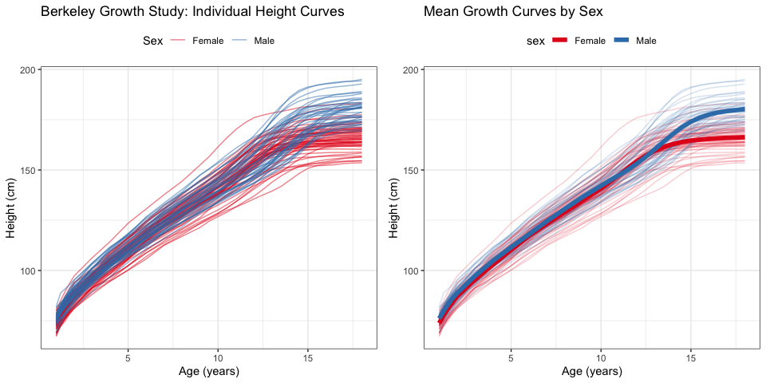
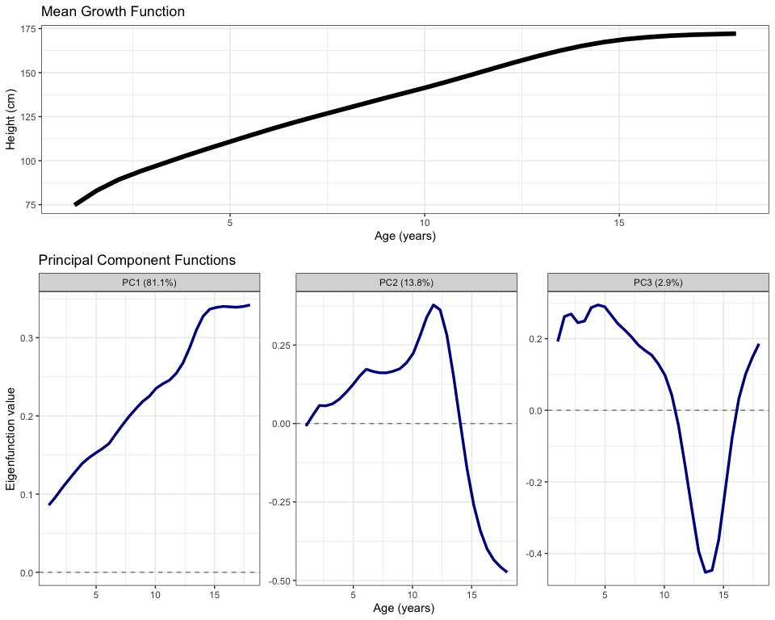
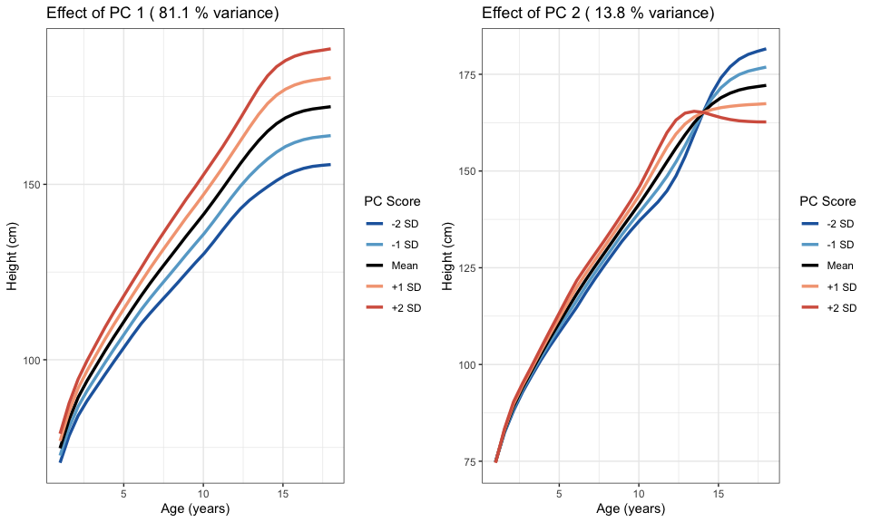
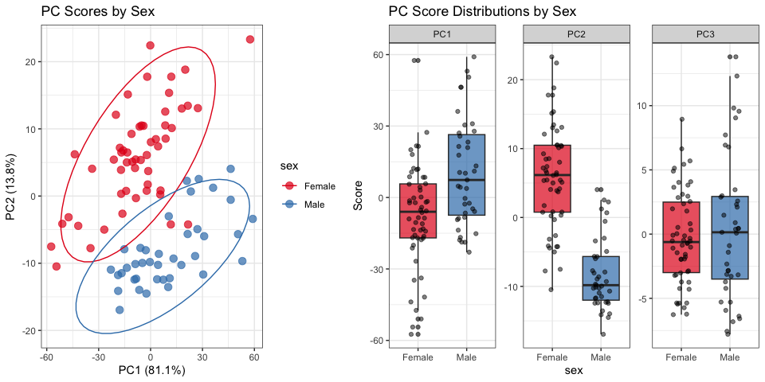
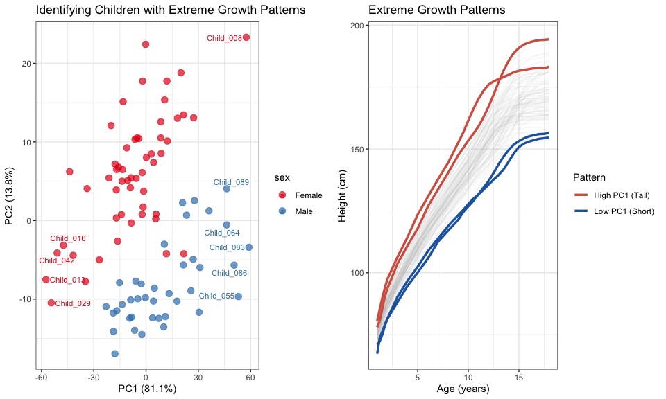

Functional Principal Component Analysis (FPCA) Tutorial
================

In this tutorial, we explore how to perform Functional Principal
Component Analysis (FPCA) using the `fdapace` package in R. FPCA is a
powerful technique for analyzing functional data - data that can be
viewed as curves or functions over a continuous domain. This is
particularly useful for time series data like growth curves, gene
expression profiles, or any measurements collected over time.

## Introduction to FPCA

FPCA extends traditional PCA to functional data. While PCA works with
vectors, FPCA works with entire curves or functions. The key idea is to
decompose functional data into:

- A mean function (average pattern)
- Principal component functions (modes of variation)
- Scores (how much each mode contributes to each curve)

## Example: Berkeley Growth Study Data

We’ll demonstrate FPCA using the classic Berkeley Growth Study dataset,
which contains height measurements of children from ages 1-18.

``` r
library(fda)        
library(fdapace)    
library(tidyverse) 
library(ggrepel)  
library(cowplot)   

theme_set(theme_bw())
```

Let’s start by exploring the growth data from the Berkley study

``` r
data(growth)
age <- growth$age

girls_height <- growth$hgtf
girls_data <- data.frame(
  age = rep(age, ncol(girls_height)),
  height = c(girls_height),
  id = rep(1:ncol(girls_height), each = length(age)),
  sex = "Female"
)

boys_height <- growth$hgtm
boys_data <- data.frame(
  age = rep(age, ncol(boys_height)),
  height = c(boys_height),
  id = rep((ncol(girls_height) + 1):(ncol(girls_height) + ncol(boys_height)), 
           each = length(age)),
  sex = "Male"
)

growth_data <- rbind(girls_data, boys_data)
growth_data$child_id <- paste0("Child_", sprintf("%03d", growth_data$id))

cat("Dataset contains:", length(unique(growth_data$child_id)), "children\n")
```

    ## Dataset contains: 93 children

``` r
cat("Girls:", sum(unique(growth_data[,c("child_id", "sex")])$sex == "Female"), "\n")
```

    ## Girls: 54

``` r
cat("Boys:", sum(unique(growth_data[,c("child_id", "sex")])$sex == "Male"), "\n")
```

    ## Boys: 39

``` r
cat("Age range:", min(age), "to", max(age), "years\n")
```

    ## Age range: 1 to 18 years

The dataset contains height measurements for 93 children (54 girls and
39 boys) measured at 31 time points from age 1 to 18 years.

## Visualizing the Raw Data

Before performing FPCA, let’s visualize the growth curves to understand
our data.

``` r
p_all_curves <- ggplot(growth_data, aes(x = age, y = height, group = child_id, color = sex)) +
  geom_line(alpha = 0.5) +
  scale_color_manual(values = c("Female" = "#E41A1C", "Male" = "#377EB8")) +
  labs(title = "Berkeley Growth Study: Individual Height Curves",
       x = "Age (years)", 
       y = "Height (cm)",
       color = "Sex") +
  theme(legend.position = "top")

mean_curves <- growth_data %>%
  group_by(age, sex) %>%
  summarise(mean_height = mean(height),
            sd_height = sd(height),
            .groups = "drop")

p_mean_curves <- ggplot() +
  geom_line(data = growth_data, 
            aes(x = age, y = height, group = child_id, color = sex), 
            alpha = 0.2) +
  geom_line(data = mean_curves, 
            aes(x = age, y = mean_height, color = sex), 
            size = 2) +
  scale_color_manual(values = c("Female" = "#E41A1C", "Male" = "#377EB8")) +
  labs(title = "Mean Growth Curves by Sex",
       x = "Age (years)", 
       y = "Height (cm)") +
  theme(legend.position = "top")
```

    ## Warning: Using `size` aesthetic for lines was deprecated in ggplot2 3.4.0.
    ## ℹ Please use `linewidth` instead.
    ## This warning is displayed once every 8 hours.
    ## Call `lifecycle::last_lifecycle_warnings()` to see where this warning was
    ## generated.

``` r
plot_grid(p_all_curves, p_mean_curves, ncol = 2)
```

<!-- -->

## Performing FPCA

Now we’ll perform FPCA on the growth curves. The first step is to
convert our data into the format required by the `fdapace` package.

``` r
fpca_input <- MakeFPCAInputs(
  IDs = growth_data$child_id,
  tVec = growth_data$age,
  yVec = growth_data$height
)

cat("FPCA input created with", length(fpca_input$Ly), "curves\n")
```

    ## FPCA input created with 93 curves

``` r
cat("Each curve has", length(fpca_input$Lt[[1]]), "time points\n")
```

    ## Each curve has 31 time points

Input Data:

Ly: List of response values (e.g., height measurements) Lt: List of time
points when measurements were taken

Main Options:

dataType = “Dense”

Use when: All subjects are measured at the same time points Alternative:
“Sparse” for irregular/missing measurements

methodSelectK = “FVE” (Fraction of Variance Explained)

Automatically selects number of principal components Other options:
“AIC”, “BIC”, or fixed number FVE is most intuitive and commonly used

FVEthreshold = 0.95

Keeps enough components to explain 95% of variation

Kernel options: “gauss” (Gaussian), “rect” (rectangular),“epan”
(Epanechnikov)

``` r
fpca_result <- FPCA(
  Ly = fpca_input$Ly,
  Lt = fpca_input$Lt,
  optns = list(
    dataType = "Dense",      
    methodSelectK = "FVE",   
    FVEthreshold = 0.95,    
    verbose = TRUE
  )
)
```

    ## No binning is needed!

``` r
var_explained <- round(diff(c(0, fpca_result$cumFVE)) * 100, 1)

cat("Components selected:", fpca_result$selectK, "\n")
```

    ## Components selected: 3

``` r
cat("Total variance explained:", round(fpca_result$cumFVE[fpca_result$selectK] * 100, 1), "%\n\n")
```

    ## Total variance explained: 97.8 %

``` r
variance_summary <- data.frame(
  PC = 1:fpca_result$selectK,
  Variance_Explained = var_explained[1:fpca_result$selectK],
  Cumulative = round(fpca_result$cumFVE[1:fpca_result$selectK] * 100, 1)
)

variance_summary %>% knitr::kable()
```

|  PC | Variance_Explained | Cumulative |
|----:|-------------------:|-----------:|
|   1 |               81.1 |       81.1 |
|   2 |               13.8 |       94.9 |
|   3 |                2.9 |       97.8 |

## Understanding the Principal Components

FPCA decomposes each curve into a mean function plus weighted
combinations of eigenfunctions (principal component functions). Let’s
visualize these components.

### Mean Function and Eigenfunctions

``` r
p_mean <- data.frame(
  age = fpca_result$workGrid,
  height = fpca_result$mu
) %>%
  ggplot(aes(x = age, y = height)) +
  geom_line(size = 2) +
  labs(title = "Mean Growth Function",
       x = "Age (years)", 
       y = "Height (cm)")

eigen_data <- data.frame(
  age = rep(fpca_result$workGrid, 3),
  value = c(fpca_result$phi[,1], fpca_result$phi[,2], fpca_result$phi[,3]),
  PC = rep(paste0("PC", 1:3, " (", var_explained[1:3], "%)"), 
           each = length(fpca_result$workGrid))
)

p_eigen <- ggplot(eigen_data, aes(x = age, y = value)) +
  geom_hline(yintercept = 0, linetype = "dashed", alpha = 0.5) +
  geom_line(size = 1.2, color = "darkblue") +
  facet_wrap(~PC, scales = "free_y") +
  labs(title = "Principal Component Functions",
       x = "Age (years)", 
       y = "Eigenfunction value")

plot_grid(p_mean, p_eigen, ncol = 1, rel_heights = c(1, 1.5))
```

<!-- -->

### Interpreting PC Effects

To understand what each PC represents, we can visualize how positive and
negative scores affect the growth curves.

``` r
show_pc_effect <- function(pc_num) {
  scores <- c(-2, -1, 0, 1, 2)
  
  effect_curves <- lapply(scores, function(s) {
    score_vec <- rep(0, fpca_result$selectK)
    score_vec[pc_num] <- s * sqrt(fpca_result$lambda[pc_num])
    curve <- fpca_result$mu + fpca_result$phi[, 1:fpca_result$selectK] %*% score_vec
    data.frame(
      age = fpca_result$workGrid,
      height = curve,
      score = factor(s, levels = c(-2, -1, 0, 1, 2),
                    labels = c("-2 SD", "-1 SD", "Mean", "+1 SD", "+2 SD"))
    )
  }) %>% bind_rows()
  
  ggplot(effect_curves, aes(x = age, y = height, color = score)) +
    geom_line(size = 1.2) +
    scale_color_manual(values = c("-2 SD" = "#2166AC", 
                                  "-1 SD" = "#67A9CF", 
                                  "Mean" = "black", 
                                  "+1 SD" = "#F4A582", 
                                  "+2 SD" = "#D6604D")) +
    labs(title = paste("Effect of PC", pc_num, "(", var_explained[pc_num], "% variance)"),
         x = "Age (years)", 
         y = "Height (cm)",
         color = "PC Score")
}

p_pc1_effect <- show_pc_effect(1)
p_pc2_effect <- show_pc_effect(2)

plot_grid(p_pc1_effect, p_pc2_effect, ncol = 2)
```

<!-- -->

**Interpretation:** - **PC1** captures overall height differences (tall
vs short children) - **PC2** captures growth timing (early vs late
growth spurts)

## Analyzing PC Scores

The PC scores tell us how much of each component is present in each
child’s growth curve.

``` r
pc_scores <- data.frame(
  child_id = unique(growth_data$child_id),
  fpca_result$xiEst
) %>%
  setNames(c("child_id", paste0("PC", 1:fpca_result$selectK))) %>%
  left_join(growth_data %>% select(child_id, sex) %>% distinct(), by = "child_id")

p_scores <- ggplot(pc_scores, aes(x = PC1, y = PC2, color = sex)) +
  geom_point(size = 3, alpha = 0.7) +
  stat_ellipse(level = 0.95) +
  scale_color_manual(values = c("Female" = "#E41A1C", "Male" = "#377EB8")) +
  labs(title = "PC Scores by Sex",
       x = paste0("PC1 (", var_explained[1], "%)"),
       y = paste0("PC2 (", var_explained[2], "%)"))

pc_scores_long <- pc_scores %>%
  pivot_longer(cols = starts_with("PC"), 
               names_to = "PC", 
               values_to = "Score") %>%
  filter(PC %in% c("PC1", "PC2", "PC3"))

p_boxes <- ggplot(pc_scores_long, aes(x = sex, y = Score, fill = sex)) +
  geom_boxplot(alpha = 0.7) +
  geom_jitter(width = 0.2, alpha = 0.5) +
  facet_wrap(~PC, scales = "free_y") +
  scale_fill_manual(values = c("Female" = "#E41A1C", "Male" = "#377EB8")) +
  labs(title = "PC Score Distributions by Sex") +
  theme(legend.position = "none")

plot_grid(p_scores, p_boxes, ncol = 2, rel_widths = c(1, 1.2))
```

<!-- -->

## Identifying Extreme Growth Patterns

We can use PC scores to identify children with unusual growth patterns.

``` r
extreme_pc1_high <- pc_scores %>% arrange(desc(PC1)) %>% head(3)
extreme_pc1_low <- pc_scores %>% arrange(PC1) %>% head(3)

top_extremes <- pc_scores %>%
  mutate(distance = sqrt(PC1^2 + PC2^2)) %>%
  arrange(desc(distance)) %>%
  head(10)

p_extreme <- ggplot(pc_scores, aes(x = PC1, y = PC2, color = sex)) +
  geom_point(size = 3, alpha = 0.7) +
  scale_color_manual(values = c("Female" = "#E41A1C", "Male" = "#377EB8")) +
  geom_text_repel(data = top_extremes, 
                  aes(label = child_id), 
                  size = 3, 
                  max.overlaps = Inf) +
  labs(title = "Identifying Children with Extreme Growth Patterns",
       x = paste0("PC1 (", var_explained[1], "%)"),
       y = paste0("PC2 (", var_explained[2], "%)"))

extreme_ids <- c(extreme_pc1_high$child_id[1:2], extreme_pc1_low$child_id[1:2])
extreme_data <- growth_data %>%
  filter(child_id %in% extreme_ids) %>%
  mutate(pattern = case_when(
    child_id %in% extreme_pc1_high$child_id ~ "High PC1 (Tall)",
    child_id %in% extreme_pc1_low$child_id ~ "Low PC1 (Short)"
  ))

p_extreme_curves <- ggplot() +
  geom_line(data = growth_data, 
            aes(x = age, y = height, group = child_id), 
            alpha = 0.1, color = "gray") +
  geom_line(data = extreme_data,
            aes(x = age, y = height, group = child_id, color = pattern),
            size = 1.2) +
  scale_color_manual(values = c("High PC1 (Tall)" = "#D6604D", 
                                "Low PC1 (Short)" = "#2166AC")) +
  labs(title = "Extreme Growth Patterns",
       x = "Age (years)", 
       y = "Height (cm)",
       color = "Pattern")

plot_grid(p_extreme, p_extreme_curves, ncol = 2)
```

<!-- --> \##
Mathematical Background

For those interested in the theory, FPCA solves the eigenequation:

``` math
\int C(s,t)\phi(t)dt = \lambda\phi(s)
```

where $`C(s,t)`$ is the covariance function. Each curve is then
represented as:

``` math
x_i(t) = \mu(t) + \sum_{k=1}^{K} \xi_{ik} \phi_k(t)
```

where: - $`\mu(t)`$ = mean function - $`\phi_k(t)`$ = k-th
eigenfunction - $`\xi_{ik}`$ = k-th PC score for individual i - K =
number of components retained
