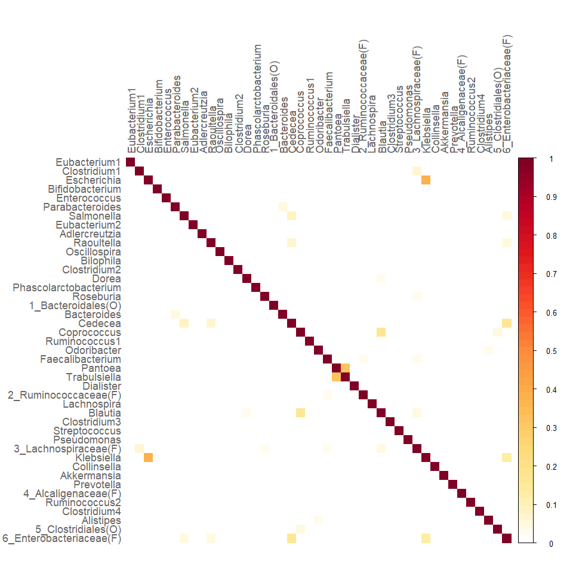
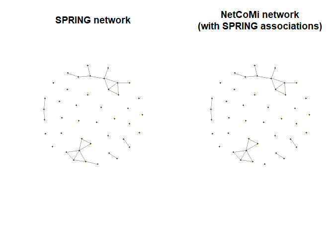
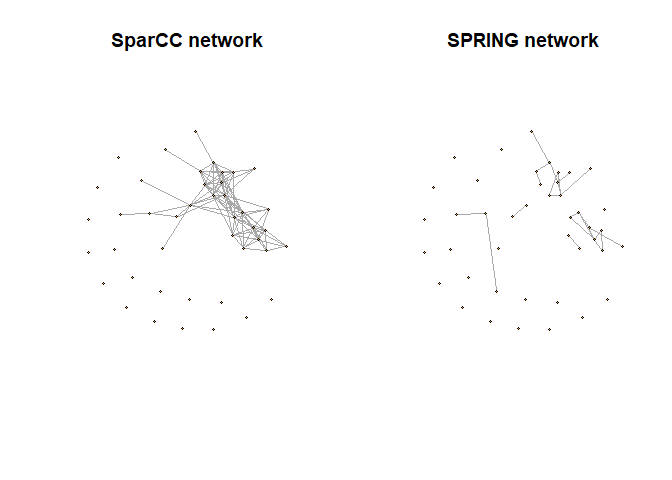
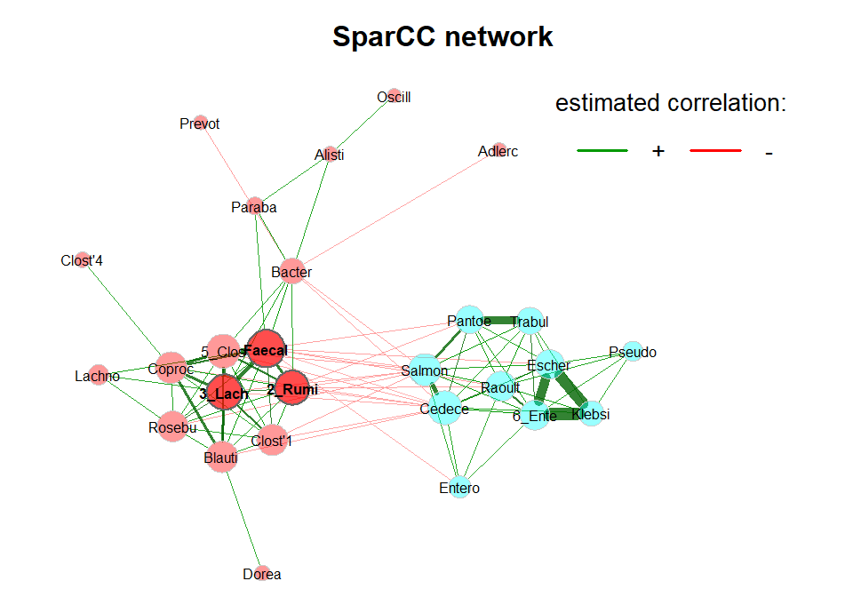
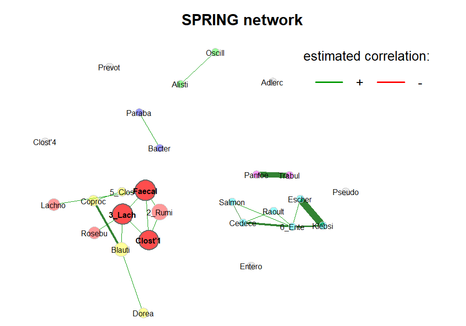

Network analysis and plotting
================
Stefanie Peschel
2025-06-30

In this script we look at a few networks and how they are plotted using
the same layout.

We will use a subset of the American gut data that come with the
SpiecEasi package.

## Load packages and data

``` r
library(SPRING)
library(NetCoMi)
```

    ## Loading required package: SpiecEasi

    ## 
    ## Attaching package: 'SpiecEasi'

    ## The following object is masked from 'package:SPRING':
    ## 
    ##     mclr

    ## 

``` r
library(phyloseq)

# Load data sets
data("amgut1.filt") # ASV count matrix
data("amgut2.filt.phy") # phyloseq objext
```

## Agglomerate data

Since we want to work on genus level, we start by agglomerating the data
and renaming them to more appealing genus names.

``` r
# Agglomerate to genus level
amgut_genus <- tax_glom(amgut2.filt.phy, taxrank = "Rank6")

# Rename taxonomic table and make Rank6 (genus) unique
amgut_genus_renamed <- renameTaxa(amgut_genus, 
                                  pat = "<name>", 
                                  substPat = "<name>_<subst_name>(<subst_R>)",
                                  numDupli = "Rank6")
```

    ## Column 7 contains NAs only and is ignored.

## SPRING network

### With NetCoMi

Here, we use the SPRING package for association estimation. We reduce
the number of repetitions and the length of the lambda path to save
runtime.

``` r
netcomi_net <- netConstruct(
    amgut_genus_renamed,
    taxRank = "Rank6",
    filtTax = "numbSamp",
    filtTaxPar = list(numbSamp = 0.2),
    measure = "spring",
    measurePar = list(thresh = 0.05, Rmethod = "approx", 
                      nlambda = 10, rep.num = 10),
    sparsMethod = "none",
    dissFunc = "signed",
    seed = 13075)
```

    ## Checking input arguments ... Done.
    ## Data filtering ...
    ## 2 rows with zero sum removed.
    ## 43 taxa and 294 samples remaining.
    ## 
    ## Calculate 'spring' associations ... Registered S3 method overwritten by 'dendextend':
    ##   method     from 
    ##   rev.hclust vegan
    ## Registered S3 method overwritten by 'seriation':
    ##   method         from 
    ##   reorder.hclust vegan
    ## Done.

We transform the adjacency matrix into a graph object so that we can use
igraph for plotting later (this is not part of the usual NetCoMi
workflow).

``` r
netcomi_graph <- SpiecEasi::adj2igraph(abs(netcomi_net$adjaMat1))
```

We can use NetCoMi’s `plotHeat` function to plot the estimated
associations as heatmap.

``` r
plotHeat(netcomi_net$assoMat1, textUpp = "none", textLow = "none")
```

<!-- -->

### With SPRING directly

Here’s an example of how to compute the correlation matrix with SPRING.
This might be useful if you don’t or can’t use NetCoMi, or already have
associations at hand.

``` r
# Count matrix (with samles in rows)
count_mat <- t(as(otu_table(amgut_genus_renamed), "matrix"))

set.seed(13075)
spring_est <- SPRING(
  count_mat,
  Rmethod = "approx",
  thresh = 0.05,
  nlambda = 10,
  rep.num = 10,
  lambdaseq = "data-specific")
```

    ## The input is identified as the covariance matrix.
    ## Conducting Meinshausen & Buhlmann graph estimation (mb)....done
    ## The input is identified as the covariance matrix.
    ## Conducting Meinshausen & Buhlmann graph estimation (mb)....done
    ## The input is identified as the covariance matrix.
    ## Conducting Meinshausen & Buhlmann graph estimation (mb)....done
    ## The input is identified as the covariance matrix.
    ## Conducting Meinshausen & Buhlmann graph estimation (mb)....done
    ## The input is identified as the covariance matrix.
    ## Conducting Meinshausen & Buhlmann graph estimation (mb)....done
    ## The input is identified as the covariance matrix.
    ## Conducting Meinshausen & Buhlmann graph estimation (mb)....done
    ## The input is identified as the covariance matrix.
    ## Conducting Meinshausen & Buhlmann graph estimation (mb)....done
    ## The input is identified as the covariance matrix.
    ## Conducting Meinshausen & Buhlmann graph estimation (mb)....done
    ## The input is identified as the covariance matrix.
    ## Conducting Meinshausen & Buhlmann graph estimation (mb)....done
    ## The input is identified as the covariance matrix.
    ## Conducting Meinshausen & Buhlmann graph estimation (mb)....done
    ## The input is identified as the covariance matrix.
    ## Conducting Meinshausen & Buhlmann graph estimation (mb)....done

``` r
# Get index of the optimal lambda selected by StARS
opt.K <- spring_est$output$stars$opt.index

# Store partial correlation matrix belonging to the optimal lambda as matrix
spring_cor <- SpiecEasi::symBeta(as.matrix(spring_est$output$est$beta[[opt.K]]))
spring_cor <- as.matrix(spring_cor)
rownames(spring_cor) <- colnames(spring_cor) <- colnames(count_mat)
diag(spring_cor) <- 1
```

We directly transform the correlations into a graph object, which we
will need for network analysis (without NetCoMi) later.

Here’s a function that does the job for us:

``` r
# Arguments:
# - assoMat: association matrix
# - threshold: associations below the threshold are set to zero
# - dissTrans: dissimilarity transformation ("signed" or "unsigned")

transform_asso <- function(assoMat, thresh = NULL, dissTrans = "signed") {
  # Sparsification
  if (!is.null(thresh)) {
      assoMat[abs(assoMat) < thresh] <- 0
  }

  # Compute dissimilarity matrix
  if (dissTrans == "signed") {
      dissMat <- sqrt(0.5 * (1 - assoMat))
  } else {
      dissMat <- sqrt(1 - assoMat^2)
  }

  # Dissimilarity between nodes with zero correlation is set to 1
  # (these nodes are unconnected and thus should have maximum dissimilarity)
  dissMat[assoMat == 0] <- 1

  # Compute similarity matrix
  simMat <- 1 - dissMat

  # Turn into igraph object
  graphObj <- SpiecEasi::adj2igraph(simMat)

  return(list(graph = graphObj, adja = simMat, asso = assoMat, diss = dissMat))
}
```

``` r
# Create graph object
spring_graph <- transform_asso(spring_cor)$graph
```

### With NetCoMi from associations

We will use the SPRING network to demonstrate how NetCoMi can be used if
we already have an association matrix.

``` r
spring_net <- netConstruct(data = spring_cor,
                           dataType = "correlation",
                           sparsMethod = "none")
```

    ## Checking input arguments ... Done.

## SparCC network

To be able to compare different networks later, we also compute a
network with SparCC, which estimates “classical” correlations instead of
partial correlations.

Since SparCC does not have a sparsification approach, we simply set a
threshold.

``` r
sparcc_net <- netConstruct(
    amgut_genus_renamed,
    taxRank = "Rank6",
    filtTax = "numbSamp",
    filtTaxPar = list(numbSamp = 0.2),
    measure = "sparcc",
    sparsMethod = "threshold",
    thresh = 0.3,
    dissFunc = "signed",
    seed = 13075)
```

    ## Checking input arguments ... Done.
    ## Data filtering ...
    ## 2 rows with zero sum removed.
    ## 43 taxa and 294 samples remaining.
    ## 
    ## Calculate 'sparcc' associations ... Done.
    ## 
    ## Sparsify associations via 'threshold' ... Done.

``` r
sparcc_graph <- SpiecEasi::adj2igraph(abs(sparcc_net$adjaMat1))
```

## Network analysis with igraph

### NetCoMi graph vs. SPRING graph

Since we created two graph objects, one with SPRING and one with
NetCoMi, we plot them side by side using the igraph package. The two
plots should be identical.

``` r
library(igraph)
```

    ## 
    ## Attaching package: 'igraph'

    ## The following object is masked from 'package:SpiecEasi':
    ## 
    ##     make_graph

    ## The following objects are masked from 'package:stats':
    ## 
    ##     decompose, spectrum

    ## The following object is masked from 'package:base':
    ## 
    ##     union

``` r
# Note size
vsize <- 3

# Fruchterman-Reingold layout from igraph package
set.seed(13075)
lay_fr <- layout_with_fr(spring_graph)

par(mfrow = c(1,2))
plot(spring_graph, layout = lay_fr, vertex.size = vsize,
     vertex.label = NA, main = "SPRING network")
plot(netcomi_graph, layout = lay_fr, vertex.size = vsize,
     vertex.label = NA, main = "NetCoMi network\n(with SPRING associations)")
```

<!-- -->

### SparCC graph vs. SPRING graph

``` r
# Note size
vsize <- 3

# Fruchterman-Reingold layout from igraph package
set.seed(13075)
lay_fr <- layout_with_fr(sparcc_graph)

par(mfrow = c(1,2))
plot(sparcc_graph, layout = lay_fr, vertex.size = vsize,
     vertex.label = NA, main = "SparCC network")
plot(spring_graph, layout = lay_fr, vertex.size = vsize,
     vertex.label = NA, main = "SPRING network")
```

<!-- -->

As expected, the SPRING network is much sparser.

## Network analysis with NetCoMi

We run the netAnalyze function for both the SPRING network and the
SparCC network to be able to plot them side by side later.

``` r
spring_props <- netAnalyze(
  netcomi_net,
  clustMethod = "cluster_fast_greedy",
  hubPar = "eigenvector",
  normDeg = FALSE,
  gcmHeat = FALSE)
```

``` r
sparcc_props <- netAnalyze(
  sparcc_net,
  clustMethod = "cluster_fast_greedy",
  hubPar = "eigenvector",
  normDeg = FALSE,
  gcmHeat = FALSE)
```

## Network plot (same layout)

We now plot both networks using the same layout.

The plot of the SparCC network is saved as plot object to reuse the
layout for the SPRING plot.

``` r
p <- plot(sparcc_props,
          layout = "spring", # force-directed layout
          repulsion = 0.98,
          rmSingles = TRUE,
          shortenLabels = "intelligent",
          labelScale = FALSE,
          nodeSize = "eigenvector",
          nodeSizeSpread = 3,
          nodeColor = "cluster",
          hubBorderCol = "gray40",
          cexNodes = 1.8,
          edgeTranspHigh = 20,
          title1 = "SparCC network",
          showTitle = TRUE,
          cexTitle = 2,
          mar = c(1, 3, 4, 8))

legend(0.7, 1.1, cex = 1.7, title = "estimated correlation:",
       legend = c("+","-"), lty = 1, lwd = 3, col = c("#009900","red"),
       bty = "n", horiz = TRUE)
```

<!-- -->

``` r
plot(spring_props,
     layout = p$layout$layout1,
     shortenLabels = "intelligent",
     labelScale = FALSE,
     nodeSize = "eigenvector",
     nodeSizeSpread = 3,
     nodeColor = "cluster",
     hubBorderCol = "gray40",
     cexNodes = 1.8,
     edgeTranspHigh = 20,
     title1 = "SPRING network",
     showTitle = TRUE,
     cexTitle = 2,
     mar = c(1, 3, 4, 8))

legend(0.7, 1.1, cex = 1.7, title = "estimated correlation:",
       legend = c("+","-"), lty = 1, lwd = 3, col = c("#009900","red"),
       bty = "n", horiz = TRUE)
```

<!-- -->
