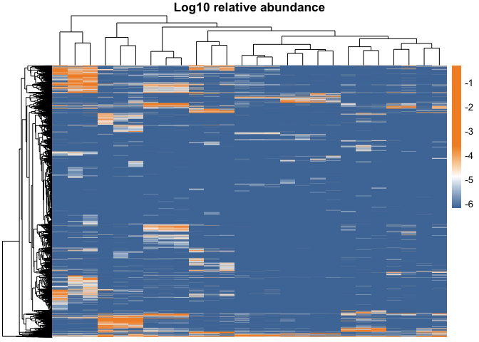
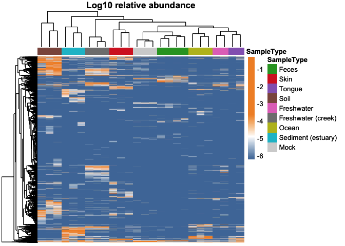

# Heatmaps in R


## Heatmaps in R

Heatmaps are a powerful visualization tool for representing matrix data,
where individual values are represented as colors. They are particularly
useful for displaying large datasets, such as those found in genomics,
to reveal patterns and clusters. This document will guide you through
creating a visually appealing and informative heatmap for count data
using the pheatmap package in R. We will focus on selecting robust color
schemes and adding annotations to enhance the interpretation of the
data.

1.  Preparing Your Data First, you’ll need to install and load the
    necessary R packages. We will use pheatmap for plotting and
    RColorBrewer for color palettes.

``` r
# Load the packages
library("pheatmap")
library("RColorBrewer")
library("ggthemes")
library("phyloseq")
```

For this tutorial, we will generate get some count data from the
phyloseq package. In a real-world scenario, you would load your own
data, for instance, from a CSV file.

``` r
# Generate sample count data

data(GlobalPatterns)
GP <- GlobalPatterns
count_data <- as.matrix(GP@otu_table@.Data)

count_data <- prop.table(count_data, margin = 2)
colSums(count_data)
```

         CL3      CC1      SV1  M31Fcsw  M11Fcsw  M31Plmr  M11Plmr  F21Plmr 
           1        1        1        1        1        1        1        1 
     M31Tong  M11Tong LMEpi24M SLEpi20M   AQC1cm   AQC4cm   AQC7cm      NP2 
           1        1        1        1        1        1        1        1 
         NP3      NP5  TRRsed1  TRRsed2  TRRsed3     TS28     TS29    Even1 
           1        1        1        1        1        1        1        1 
       Even2    Even3 
           1        1 

``` r
write.csv(count_data, file = "./data/count.csv")

set.seed(123) # for reproducibility
#count_data_high <- matrix(rpois(1000, lambda = 1000), nrow = 100, ncol = 100)
#count_data_low <- matrix(rpois(9000, lambda = 100), nrow = 900, ncol = 100)
#count_data <- rbind(count_data_high, count_data_low)
#rownames(count_data) <- paste0("ASV", 1:1000)
#colnames(count_data) <- paste0("Sample", 1:100)

# Create annotation data for columns (e.g., sample type)
col_annotation <- data.frame(
  SampleType = factor(GP@sam_data$SampleType),
  row.names = colnames(count_data)
)
write.csv(col_annotation, file = "./data/annotation.csv")


# Create annotation data for rows (e.g., gene pathway)
row_annotation <- data.frame(
  Pathway = factor(sample(c("A", "B", "C"), nrow(GP@otu_table), replace = TRUE)),
  row.names = rownames(count_data)
)
```

2.  Creating a Basic Heatmap With our data ready, let’s create a simple
    heatmap using the pheatmap() function.

``` r
pheatmap(count_data, cluster_rows = FALSE, cluster_cols = FALSE)
```


As you can see, you see nothing.

3.  Choosing a Robust Color Scheme The default color scheme is
    functional, but we can do better. For count data, a sequential color
    palette is often a good choice, as it represents the range from low
    to high values. The RColorBrewer package offers a wide range of
    palettes.

Let’s select a blue palette and customize the color breaks and do a log
transformation of the data.

``` r
# replace by min value / 2
min_value <- min(count_data[count_data != 0])
count_data[count_data == 0] <- min_value / 2
# log10 transform
count_data <- log10(count_data + min_value)

# Compositional aware distance
geometric_mean <- colMeans(count_data)
clr_data <- sweep(count_data, 2, geometric_mean, FUN = "-")
sample_dist <- dist(t(clr_data))

# Choose a color palette
diverging_palette <- colorRampPalette(c("#4E79A7", "white", "#F28E2B"))(100)
my_breaks <- seq(0, max(count_data), length.out = 100)


p <- pheatmap(count_data,
         color = diverging_palette,
         annotation_colors = ann_colors,
         clustering_distance_cols = sample_dist,
         show_rownames = FALSE,
         show_colnames = FALSE,
         border_color = NA,
         main = "Log10 relative abundance")

p
```


To have similar plots as in seaborn one might want to have a more robust
color scheme, dependent on the story you want to tell.

``` r
# Assuming 'count_data' is your data matrix
# 1. Calculate the 98th and 2nd quantile
quantile_upper_plt <- quantile(unique(count_data), probs = 0.98)
quantile_lower_plt <- quantile(unique(count_data), probs = 0.02)


# 3. Create the breaks for the color scale
# This creates 100 steps between the min and the 2nd, 98th quantile and max value
my_breaks <- c(min(count_data), 
  seq(quantile_lower_plt, quantile_upper_plt, length.out = 100),
  max(count_data) # The final break is the max value
)

# In case there are duplicates because min or max correspond to one of those quantiles
my_breaks <- unique(my_breaks)
diverging_palette <- colorRampPalette(c("#4E79A7", "white", "#F28E2B"))(length(my_breaks))

# 4. Create the heatmap
pheatmap(count_data,
         color = diverging_palette,
         breaks = my_breaks,
         show_rownames = FALSE,
         show_colnames = FALSE,
         clustering_distance_cols = sample_dist,
         border_color = NA,
         main = "Log10 relative abundance")
```



4.  Adding Annotations Annotations provide additional context to your
    heatmap. We can add our previously created col_annotation and
    row_annotation data frames. pheatmap will automatically color the
    annotation tracks.

``` r
pheatmap(count_data,
         color = diverging_palette,
         breaks = my_breaks,
         show_rownames = FALSE,
         show_colnames = FALSE,
         border_color = NA,
         clustering_distance_cols = sample_dist,
         main = "Log10 relative abundance",
         annotation_col = col_annotation)
```


You can also customize the colors for your annotations.

``` r
#| echo: true
#| fig-cap: "Heatmap with custom annotation colors."

# Define colors for annotations
ann_colors <- list(
  SampleType = c(Feces = "#2ca02c", Skin = "#d62728", Tongue = "#9467bd",
                 Soil = "#8c564b", Freshwater = "#e377c2", 'Freshwater (creek)' = "#7f7f7f",
                 Ocean = "#bcbd22", 'Sediment (estuary)' = "#17becf", Mock = "lightgrey"),
  Pathway = c(A =  "#4f6980", B = "#638b66", C = "#7e756d")
)

p <- pheatmap(count_data,
         color = diverging_palette,
         breaks = my_breaks,
         main = "Log10 relative abundance",
         annotation_col = col_annotation,
         annotation_colors = ann_colors,
         clustering_distance_cols = sample_dist,
         show_rownames = FALSE,
         show_colnames = FALSE,
         border_color = NA)

p
```



You might also want to add axis title.

``` r
library(grid)

## Create the heatmap:

#p
#grid.text("ASVs", x = 0.95, y = 0.5, rot = 270, gp = gpar(fontsize = 12))
#grid.text("Samples", x = 0.3, y = 0.05, gp = gpar(fontsize = 12))
```
